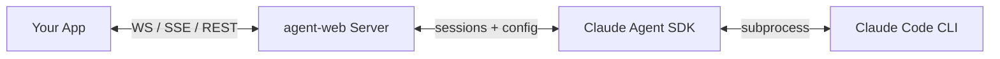
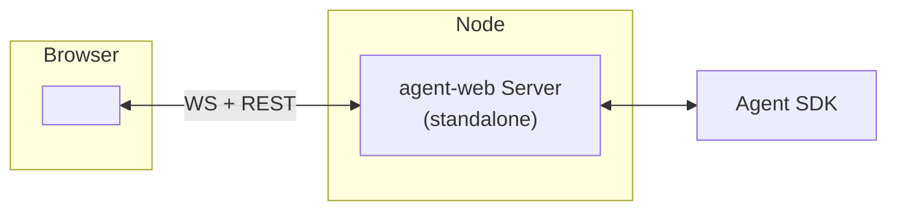
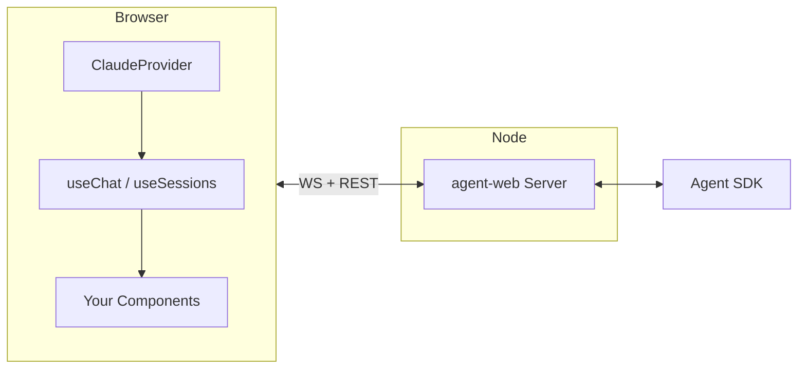
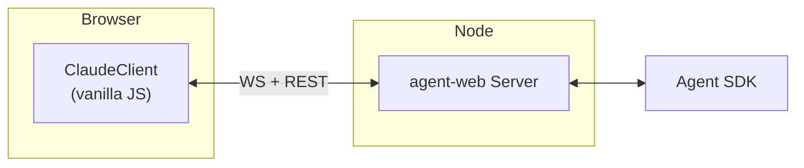
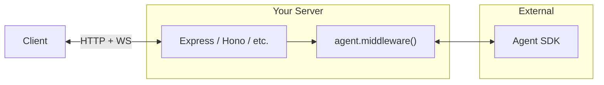
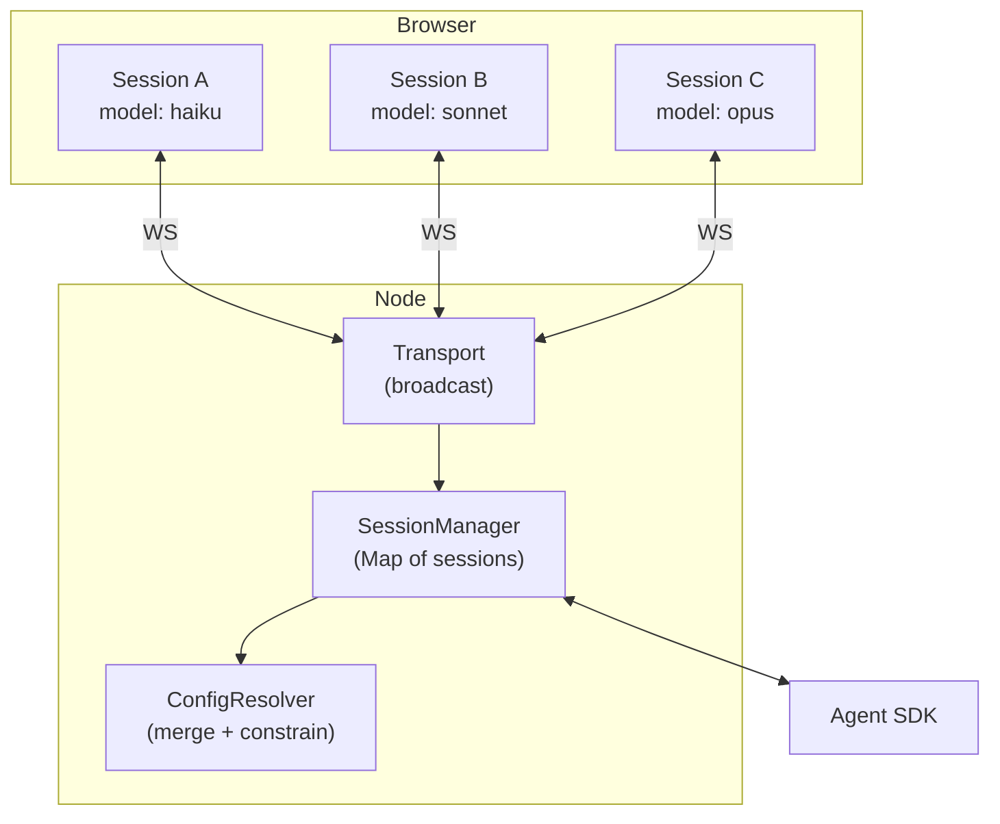
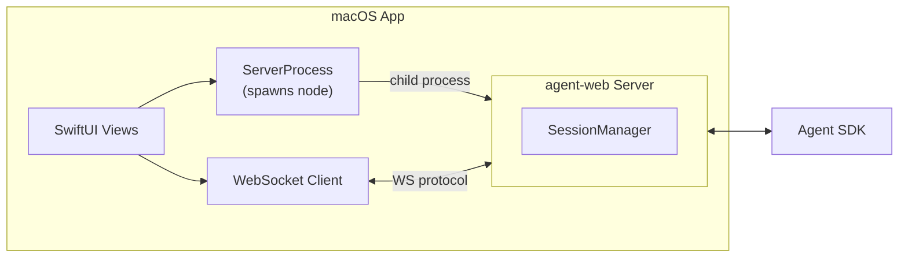
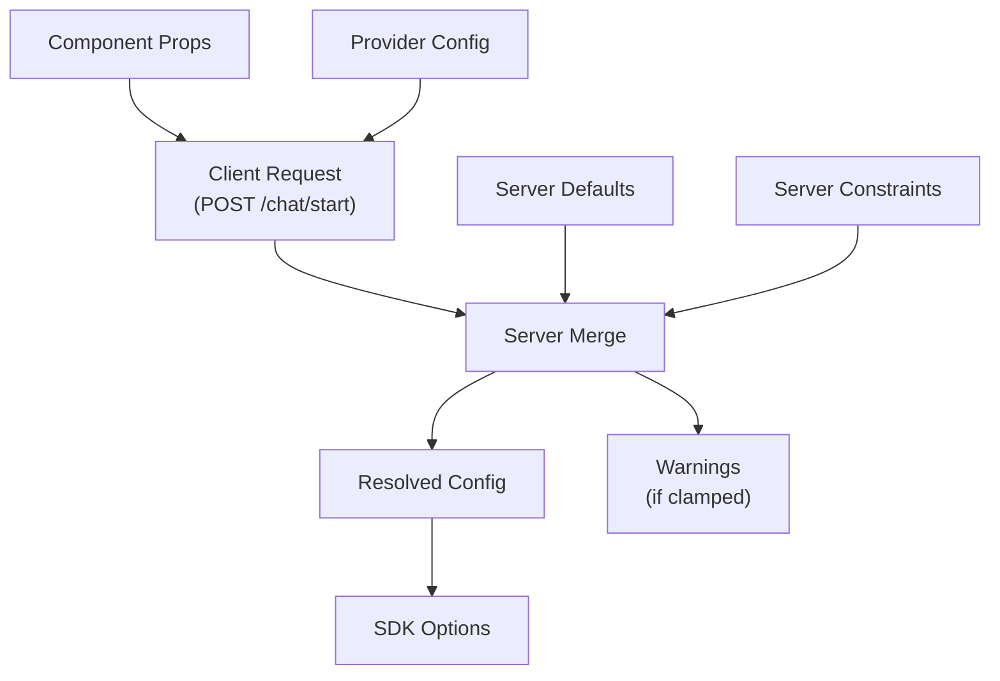

# @shaykec/agent-web

A framework for adding Claude Code capabilities to any application — web, desktop, or server. Provides a Node.js server that wraps the [Claude Agent SDK](https://docs.anthropic.com/en/docs/agents-sdk), a layered configuration model, and multiple client integration options.

## How It Works



Your application talks to the agent-web server over standard protocols. The server manages sessions, resolves configuration, and streams Claude responses back. Claude Code runs locally via the SDK — no API key required if you have a Claude subscription.

## When to Use What

| I want to… | Use | Example |
|---|---|---|
| Drop a chat widget into my React app | **Embeddable Component** (`<ClaudeChat />`) | Product support bot, internal tool |
| Build a custom chat UI with full control | **React Hooks** (`useChat`, `useSessions`) | IDE-like experience, branded AI assistant |
| Add Claude to a non-React app (Vue, Svelte, vanilla) | **Vanilla JS Client** (`ClaudeClient`) | Any framework, or no framework |
| Mount Claude as a route on my Express/Hono server | **Server Middleware** (`agent.middleware()`) | Multi-service backend, API gateway |
| Run multiple concurrent conversations with config control | **Multi-Session** | Agent dashboard, team collaboration |
| Build a native desktop app with Claude | **WebSocket Protocol** | macOS (SwiftUI), Electron, Tauri |

---

## Integration Architectures

### 1. Embeddable Component

Best for: quickly adding a chat widget to any React app.



```jsx
import { ClaudeChat } from '@shaykec/agent-web/components';

function App() {
  return <ClaudeChat url="http://localhost:3456" theme="dark" />;
}
```

One line to render. The component handles connection, session management, streaming, tool-use display, and reconnection. Pass `config` props to control model, tools, and system prompt.

### 2. React Hooks (Custom UI)

Best for: full control over the UI while letting the framework handle protocol and state.



```jsx
import { ClaudeProvider, useChat, useSessions } from '@shaykec/agent-web/react';

function App() {
  return (
    <ClaudeProvider url="http://localhost:3456" config={{ model: 'claude-sonnet-4-6' }}>
      <MyChatUI />
    </ClaudeProvider>
  );
}

function MyChatUI() {
  const { messages, send, stop, isStreaming, resolvedConfig } = useChat();
  const { sessions, create, resume } = useSessions();
  // Render however you want
}
```

### 3. Vanilla JS Client

Best for: non-React frameworks (Vue, Svelte, Angular) or plain HTML pages.



```javascript
import { ClaudeClient } from '@shaykec/agent-web/client';

const client = new ClaudeClient('http://localhost:3456');
await client.connect();

const { sessionId } = await client.createSession();
client.onMessage((msg) => console.log(msg));
await client.send(sessionId, 'What files are here?');
```

### 4. Server Middleware

Best for: mounting Claude alongside existing routes on your HTTP server.



```javascript
import express from 'express';
import { createAgentServer } from '@shaykec/agent-web/server';

const app = express();
const agent = createAgentServer({ config: { model: 'claude-sonnet-4-6' } });

app.use('/claude', agent.middleware());
agent.attachWebSocket(server, '/claude/ws');
```

### 5. Multi-Session + Config Control

Best for: dashboards, admin tools, or apps that need multiple concurrent conversations with per-session configuration.



Each session can request its own model, tools, and system prompt. The server merges requests with defaults and enforces constraints (e.g., `maxModel`, `disallowedTools`). Messages are tagged with `sessionId` so clients route them correctly.

### 6. Native Desktop App (macOS / Electron / Tauri)

Best for: native apps with an embedded server — users just launch the app.



The macOS demo app **embeds the agent-web server** as a child process. Users just launch the app — `ServerProcess` finds `node`, starts `server.js`, health-checks, and auto-connects via WebSocket. Server logs are visible in-app. Any language/framework that speaks WebSocket can integrate — the [protocol](#protocol) is simple JSON envelopes.

---

## Server Setup

```javascript
import { createAgentServer } from '@shaykec/agent-web/server';

const agent = createAgentServer({
  config: {               // Default session config
    model: 'claude-sonnet-4-6',
    tools: ['Bash(*)', 'Read', 'Write', 'Edit', 'Glob', 'Grep'],
    systemPrompt: 'You are a helpful assistant.',
    plugins: [{ type: 'local', path: './my-plugin' }],
    agents: {
      reviewer: { description: 'Code reviewer', prompt: '...', tools: ['Read', 'Grep'] },
    },
  },
  constraints: {          // Hard limits clients cannot exceed
    maxModel: 'claude-sonnet-4-6',
    disallowedTools: [],
    maxTurns: 100,
  },
  hooks: {                // Server-side event hooks
    onSessionStart: ({ sessionId, config }) => {},
    onMessage: (envelope) => {},
    onToolUse: (payload, sessionId) => {},
    onError: (err) => {},
    onClientConnect: (info) => {},
    onClientDisconnect: (info) => {},
  },
});

agent.listen(3456);
```

### REST Endpoints

| Endpoint | Method | Description |
|---|---|---|
| `/chat/start` | POST | Create a new session (`{ config }`) |
| `/chat/message` | POST | Send a message (`{ sessionId, text }`) |
| `/chat/stop` | POST | Stop generation (`{ sessionId }`) |
| `/chat/resume` | POST | Resume session (`{ sessionId, config }`) |
| `/chat/sessions` | GET | List available sessions |
| `/chat/config` | GET | Get server config (sanitized) |
| `/health` | GET | Health check |
| `/ws` | WS | WebSocket endpoint |
| `/sse` | GET | SSE stream |

---

## Configuration Model

Config flows through a merge pipeline with clear precedence:



| Field | Server | Client | Merge Rule |
|---|---|---|---|
| model | cap via `maxModel` | request | clamped to ceiling |
| tools | superset | narrow | intersection (client can only reduce) |
| disallowedTools | block | block | union (always honored) |
| systemPrompt | base | append | concatenated |
| maxTurns | cap | request | min() |
| agents | define | select subset | server validates |
| plugins, cwd, permissionMode, mcpServers | set | — | server-only (never sent to client) |

---

## Protocol

All messages use a standard JSON envelope:

```json
{
  "v": 1,
  "type": "chat:stream",
  "payload": { "delta": "..." },
  "source": "server",
  "timestamp": 1710000000,
  "sessionId": "uuid"
}
```

### Message Types

| Category | Types | Direction |
|---|---|---|
| Chat | `stream`, `assistant`, `tool-use`, `tool-result`, `status`, `error`, `user` | Server → Client |
| Session | `created`, `resumed`, `list`, `closed` | Server → Client |
| Config | `request`, `resolved` | Bidirectional |
| System | `connect`, `disconnect`, `heartbeat` | Bidirectional |

### Transport

- **WebSocket** (primary): bidirectional, real-time streaming. Client sends `sys:connect` handshake, server acknowledges with `clientId`.
- **SSE** (fallback): server-push only. Client sends messages via REST POST. Auto-fallback if WS fails.
- **REST**: stateless endpoints for session management and message sending. Always available.

---

## Modules

| Import | Contents |
|---|---|
| `@shaykec/agent-web/server` | `createAgentServer()`, `SessionManager`, `ConfigResolver`, `Transport` |
| `@shaykec/agent-web/react` | `ClaudeProvider`, `useChat`, `useSessions`, `useConnection` |
| `@shaykec/agent-web/components` | `ClaudeChat`, `ClaudeMessage`, `ClaudeToolUse` |
| `@shaykec/agent-web/client` | `ClaudeClient` (vanilla JS, framework-agnostic) |
| `@shaykec/agent-web/protocol` | Message types, `createEnvelope`, `parseEnvelope`, config schema |

---

## Examples

Seven reference implementations — each serves as documentation, test target, and starting point:

| Example | Port | Use Case | Run |
|---|---|---|---|
| [`minimal-chat`](examples/minimal-chat/) | 3456 | **Quickstart** — simplest possible demo | `node examples/minimal-chat/server.js` |
| [`react-embeddable`](examples/react-embeddable/) | 4010 | Drop-in `<ClaudeChat />` widget | `node examples/react-embeddable/server.js` |
| [`react-custom-hooks`](examples/react-custom-hooks/) | 4011 | Custom UI with hooks | `node examples/react-custom-hooks/server.js` |
| [`vanilla-js`](examples/vanilla-js/) | 4012 | Framework-agnostic client | `node examples/vanilla-js/server.js` |
| [`express-middleware`](examples/express-middleware/) | 4014 | Express `app.use()` integration | `node examples/express-middleware/server.js` |
| [`multi-session`](examples/multi-session/) | 4015 | Config negotiation + concurrent sessions | `node examples/multi-session/server.js` |
| [`macos-app`](examples/macos-app/) | 4020 | Native macOS app (**embedded server**) | `cd examples/macos-app/AgentChat && swift run` |

### Quickstart

```bash
git clone https://github.com/shayke-cohen/local-agent-web.git
cd local-agent-web && npm install
node examples/minimal-chat/server.js
# Open http://localhost:3456
```

---

## Testing

**292 total tests** across Node.js and Swift:

| Tier | Command | Tests | What It Tests |
|---|---|---|---|
| Unit | `npm run test:unit` | ~170 | Protocol, server logic, client hooks, components, vanilla client |
| Integration | `npm run test:integration` | ~50 | Real HTTP server, WebSocket handshake, config negotiation, macOS server |
| E2E (SDK) | `npm run test:e2e` | 5 | Real Claude Agent SDK via local CLI (no API key needed) |
| E2E (macOS) | `npm run test:e2e:macos` | 4 | Build macOS app, server health, session creation |
| E2E (Browser) | `npm run test:e2e:browser` | — | Browser tests via Argus MCP against demo apps |
| Swift | `swift test` (in `examples/macos-app/AgentChat`) | 49 | Models, settings, view model, server process |

```bash
npm test                  # All Node.js tests (243)
npm run test:e2e          # Real Claude Code CLI
npm run test:coverage     # Coverage report

# Swift tests
cd examples/macos-app/AgentChat && swift test   # 49 tests
```

---

## Requirements

- Node.js >= 18
- `@anthropic-ai/claude-agent-sdk` (peer dependency, for server)
- React >= 18 (peer dependency, for hooks/components — optional)
- Claude Code CLI (for E2E tests — optional)

## Architecture

See [docs/architecture.md](docs/architecture.md) for detailed system diagrams, data flows, session lifecycle, and security model.

## License

MIT — [github.com/shayke-cohen/local-agent-web](https://github.com/shayke-cohen/local-agent-web)
