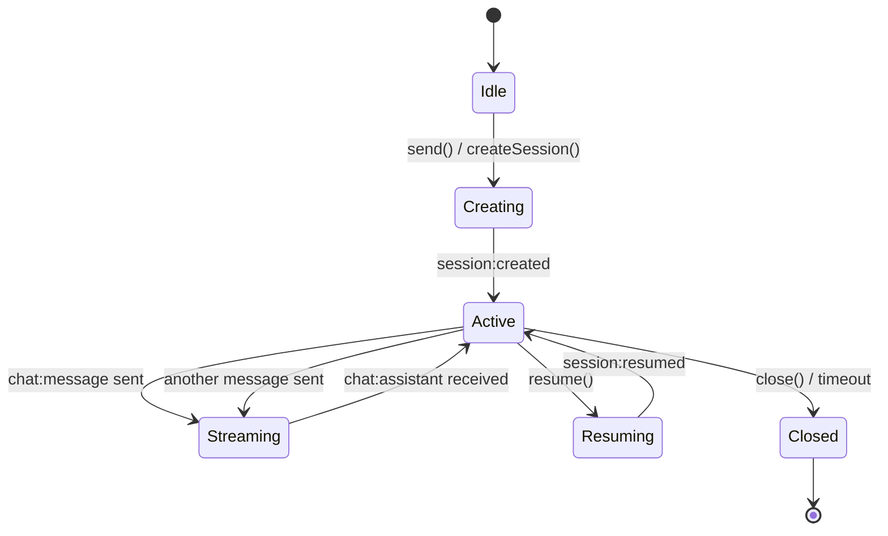
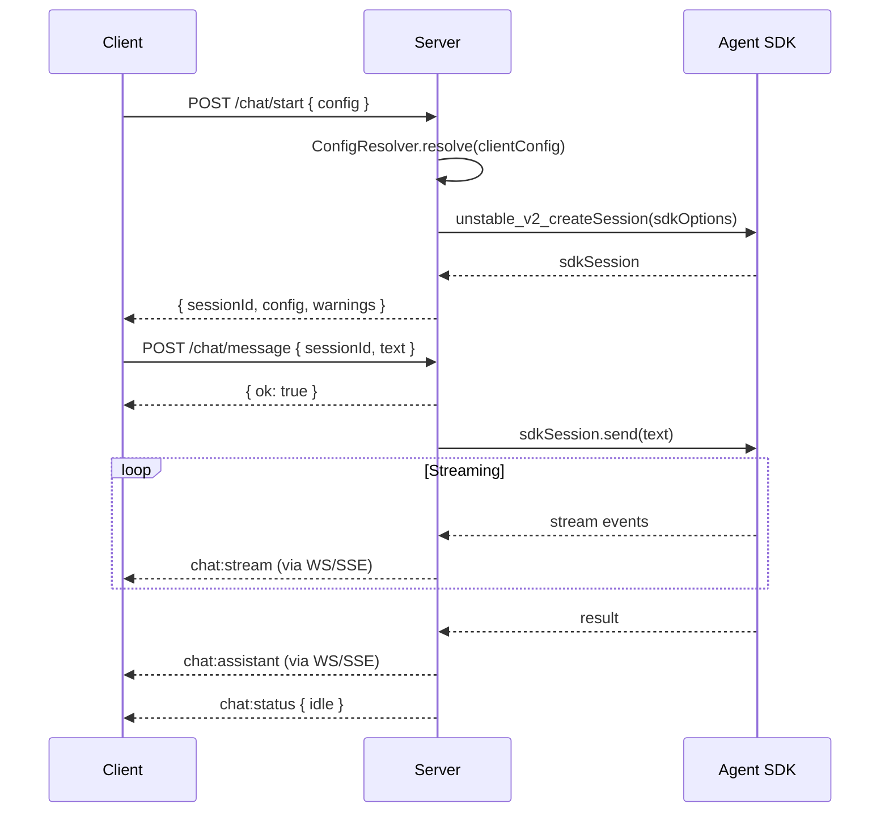
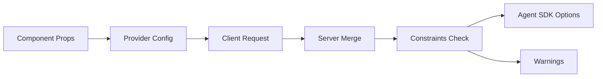
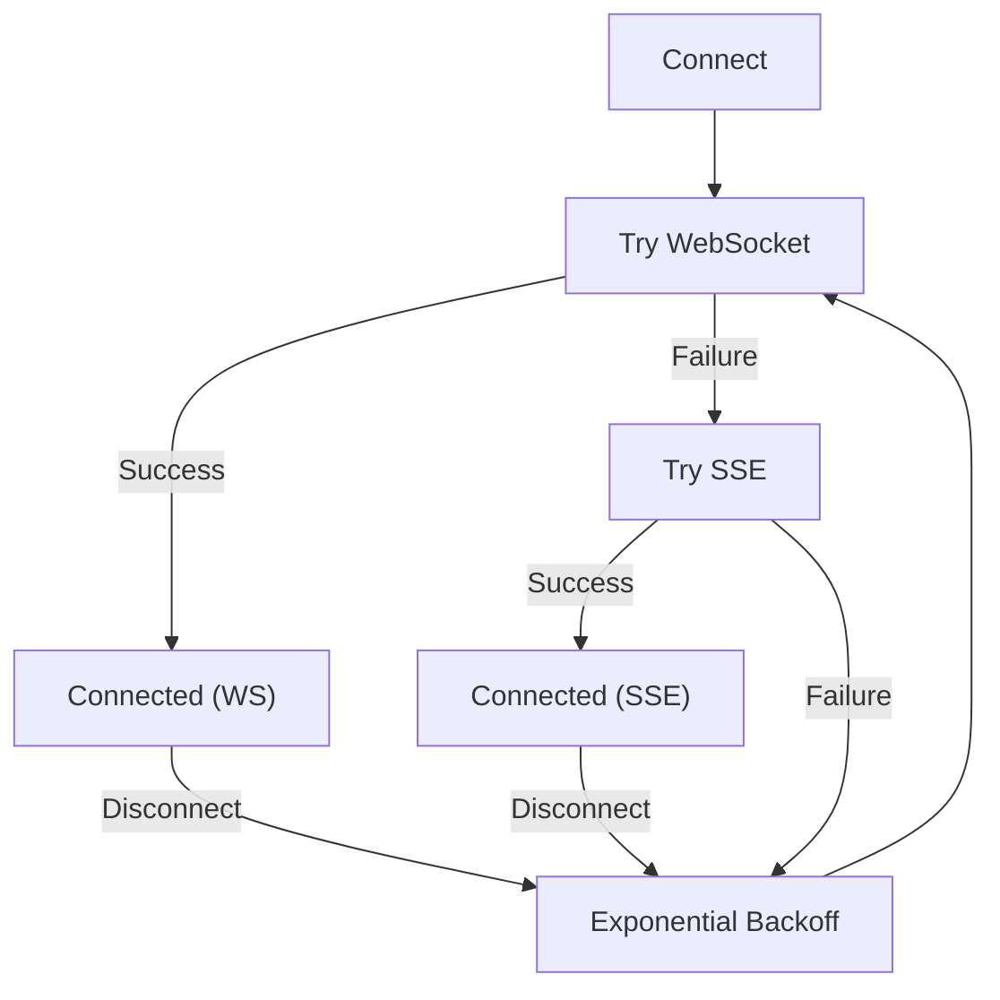

# @shaykec/agent-web — Specification

> Living specification. Updated with every functional change.

## 1. Overview

`@shaykec/agent-web` is a generic framework for exposing Claude Code capabilities to web applications. It provides a server middleware, React hooks, embeddable UI components, and a framework-agnostic vanilla JS client.

The framework wraps the `@anthropic-ai/claude-agent-sdk` to provide:
- Multi-session management with streaming
- Layered configuration with server-enforced constraints
- Dual transport (WebSocket + SSE) with auto-reconnect
- A standard protocol envelope for all messages

## 2. Functional Requirements

### 2.1 Server

| ID | Requirement | Status |
|----|-------------|--------|
| S-1 | Create and manage multiple Claude Code sessions concurrently | Done |
| S-2 | Stream responses via WebSocket and SSE transports | Done |
| S-3 | Expose REST API for session CRUD + messaging | Done |
| S-4 | Resolve layered config: server defaults + client request + constraints | Done |
| S-5 | Provide server-side hooks for session/message/tool/error events | Done |
| S-6 | Support standalone server and middleware attachment modes | Done |
| S-7 | Enforce `basePath` prefix for all routes | Done |
| S-8 | Health endpoint with version, uptime, client/session counts | Done |
| S-9 | CORS headers on all responses | Done |
| S-10 | WebSocket handshake validation (protocol version check) | Done |

### 2.2 Transport

| ID | Requirement | Status |
|----|-------------|--------|
| T-1 | WebSocket as primary transport (bidirectional) | Done |
| T-2 | SSE as fallback transport (server-to-client) | Done |
| T-3 | REST fallback for sending events when SSE-only | Done |
| T-4 | Automatic reconnect with exponential backoff (max 30s) | Done |
| T-5 | Broadcast messages to all connected clients | Done |
| T-6 | Targeted message delivery to specific clients | Done |
| T-7 | Periodic heartbeat broadcasts | Done |
| T-8 | Client lifecycle callbacks (connect/disconnect) | Done |

### 2.3 Configuration

| ID | Requirement | Status |
|----|-------------|--------|
| C-1 | Server defines default config and hard constraints | Done |
| C-2 | Client can request model (clamped by maxModel) | Done |
| C-3 | Client can narrow tools (never expand server superset) | Done |
| C-4 | disallowedTools are unioned across all layers | Done |
| C-5 | systemPrompt concatenated: server first, client appended | Done |
| C-6 | plugins, cwd, permissionMode, mcpServers are server-only | Done |
| C-7 | maxTurns resolved as min() across all layers | Done |
| C-8 | Agents: server defines, client selects subset | Done |
| C-9 | Warnings returned when client config is clamped/rejected | Done |

### 2.4 React Client

| ID | Requirement | Status |
|----|-------------|--------|
| R-1 | `ClaudeProvider` context with connection state and message bus | Done |
| R-2 | `useChat` hook: messages, send, stop, streaming status | Done |
| R-3 | `useSessions` hook: list, create, resume sessions | Done |
| R-4 | `useConnection` hook: WS/SSE transport management | Done |
| R-5 | Auto-create session on first message send | Done |
| R-6 | Message accumulation for all types (stream, assistant, tool, error) | Done |

### 2.5 Embeddable Component

| ID | Requirement | Status |
|----|-------------|--------|
| E-1 | `<ClaudeChat />` renders complete chat UI with one prop (url) | Done |
| E-2 | Dark and light theme support | Done |
| E-3 | Session picker panel (toggle) | Done |
| E-4 | Markdown-ish rendering (code blocks, inline code) | Done |
| E-5 | Tool-use display with expand/collapse | Done |
| E-6 | Streaming cursor animation | Done |
| E-7 | Custom className and style props | Done |

### 2.6 Vanilla JS Client

| ID | Requirement | Status |
|----|-------------|--------|
| V-1 | Connect via WebSocket with handshake | Done |
| V-2 | Subscribe/unsubscribe message listeners | Done |
| V-3 | createSession, send, stop, resume, listSessions via REST | Done |
| V-4 | Disconnect and cleanup | Done |

## 3. User Flows

### 3.1 Session Lifecycle



### 3.2 Message Flow



### 3.3 Config Negotiation



### 3.4 Transport Fallback



## 4. Component Wireframes

### ClaudeChat Component

```
┌─────────────────────────────────────────┐
│ Claude  [model badge]  ● [Sessions]     │  Header
├─────────────────────────────────────────┤
│                                         │
│  Start a conversation with Claude       │  Empty state
│                                         │
│  ┌─────────────────────────────┐        │
│  │ User message (right-aligned)│        │  User bubble
│  └─────────────────────────────┘        │
│  ┌────────────────────────────────┐     │
│  │ Assistant message              │     │  Assistant bubble
│  │ with `code` and ```blocks```   │     │
│  └────────────────────────────────┘     │
│  ┌[B] $ npm test             ▶ ┐       │  Tool use
│  └─────────────────────────────┘        │
│                                         │
├─────────────────────────────────────────┤
│ [  Ask Claude...          ] [Send]      │  Input bar
└─────────────────────────────────────────┘
```

## 5. Non-Functional Requirements

| Requirement | Target |
|-------------|--------|
| First message latency | < 500ms to server |
| Reconnect backoff | 1s, 2s, 4s, ... 30s max |
| Max event queue | Not applicable (streaming) |
| Bundle size (server) | < 50KB source |
| Bundle size (client) | < 30KB source |
| Node.js version | >= 18 |
| React version | >= 18 |

## 6. Protocol

16 message types across 4 categories:
- **chat** (7): stream, assistant, tool-use, tool-result, status, error, user
- **session** (4): created, resumed, list, closed
- **config** (2): request, resolved
- **sys** (3): connect, disconnect, heartbeat

Envelope format: `{ v, type, payload, source, timestamp, sessionId? }`

## 7. Change Log

| Date | Change |
|------|--------|
| 2026-03-14 | Initial specification. All core modules implemented. |
| 2026-03-14 | Full test suite: 221 unit/integration tests + E2E tests. |
| 2026-03-14 | 5 reference demos + Argus YAML browser tests. |
| 2026-03-14 | Fixed port 0 handling in listen(). Fixed WebSocket.OPEN references for jsdom. |
