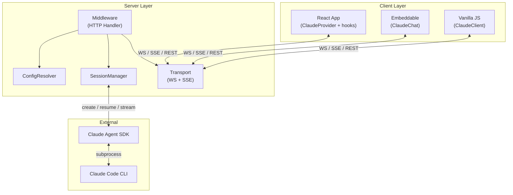
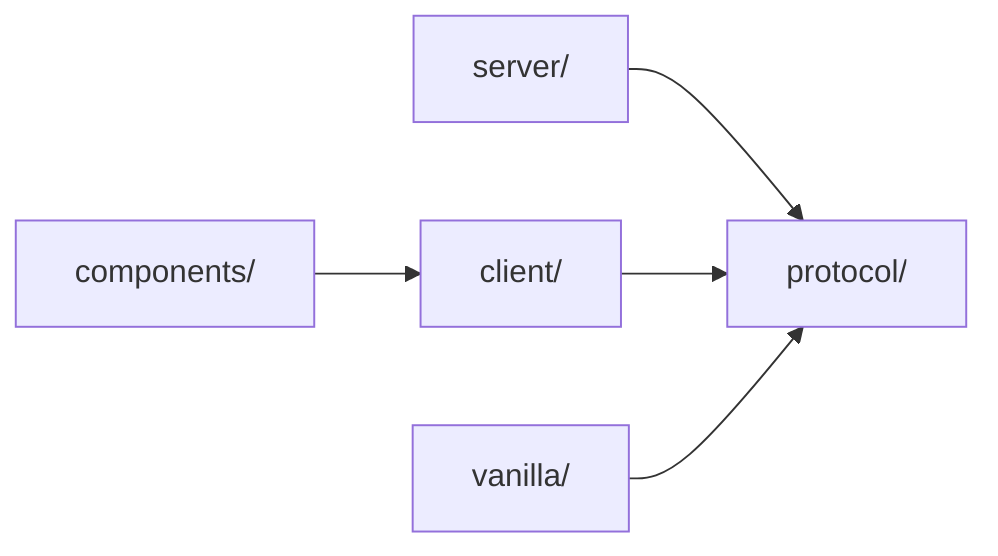
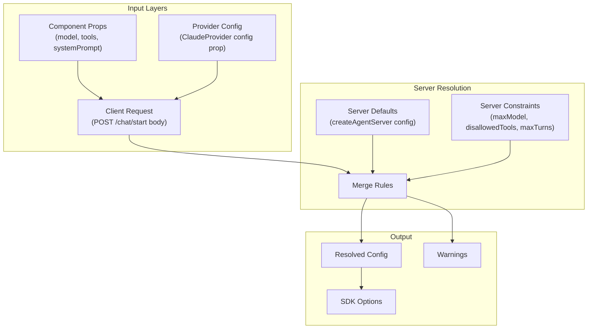
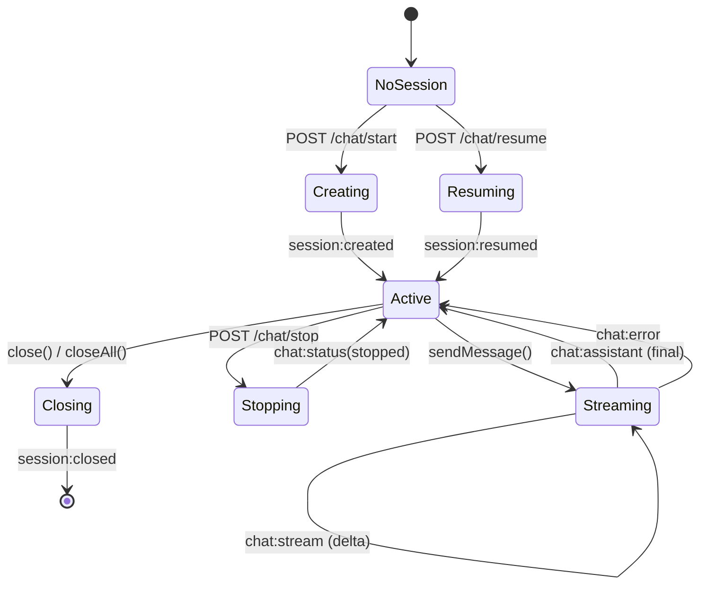

# Architecture

## System Overview



## Module Dependency Graph



Protocol is the foundation — zero dependencies. Server, client, and vanilla all depend on protocol. Components layer on top of client hooks.

## Data Flow

### Request Path

```
User Input
  → useChat.send(text)
    → POST /chat/message { sessionId, text }
      → AgentServer._handleChatMessage()
        → SessionManager.sendMessage(sessionId, text)
          → sdkSession.send(text)
            → Claude Code CLI
```

### Response Path

```
Claude Code CLI
  → SDK stream events
    → SessionManager (for await...of stream)
      → createEnvelope(type, payload)
        → onMessage callback
          → Transport.broadcast(envelope)
            → WebSocket.send() / SSE res.write()
              → useChat.handleEnvelope()
                → setMessages([...])
                  → UI re-render
```

## Config Resolution Pipeline



### Merge Rules

| Field | Rule |
|-------|------|
| model | Client requests, server clamps via `maxModel` |
| tools | Intersection: client narrows server superset |
| disallowedTools | Union across all layers |
| systemPrompt | Concatenation: server + client |
| plugins | Server-only |
| cwd | Server-only |
| permissionMode | Server-only |
| maxTurns | `min()` across all layers |
| agents | Server defines, client selects subset |
| mcpServers | Server-only |

## Session Lifecycle



## Transport Layer

### WebSocket Connection

```
Client                          Server
  |                               |
  |--- new WebSocket(/ws) ------->|
  |                               |
  |--- sys:connect { clientType,  |
  |    protocolVersion } -------->|  Handshake
  |                               |
  |<-- sys:connect { clientId,    |
  |    serverVersion } -----------|  Ack
  |                               |
  |<-- chat:stream { delta } -----|
  |<-- chat:assistant { text } ---|  Messages
  |<-- sys:heartbeat -------------|
  |                               |
  |--- chat:send { text } ------->|  Client can send via WS
  |                               |
```

### SSE Connection

```
Client                          Server
  |                               |
  |--- GET /sse ----------------->|
  |                               |
  |<-- data: sys:connect ---------|  Auto-sent on connect
  |<-- data: chat:stream ---------|
  |<-- data: chat:assistant ------|  Server push only
  |<-- data: sys:heartbeat ------|
  |                               |
  |--- POST /chat/message ------->|  Client sends via REST
  |                               |
```

### Fallback Chain

1. Try WebSocket connection
2. If WS fails (network, firewall, proxy): fall back to SSE
3. If SSE fails: exponential backoff, retry from step 1
4. Client sends via WS when available, REST POST when SSE-only

## Protocol Envelope

All messages use a standard envelope:

```javascript
{
  v: 1,                    // Protocol version
  type: 'chat:stream',     // One of 16 message types
  payload: { ... },        // Type-specific data
  source: 'server',        // 'server' | 'client'
  timestamp: 1710000000,   // Unix ms
  sessionId: 'uuid',       // Optional — links to session
}
```

### Message Categories

| Category | Types | Direction |
|----------|-------|-----------|
| chat | stream, assistant, tool-use, tool-result, status, error, user | Server → Client (user is echoed) |
| session | created, resumed, list, closed | Server → Client |
| config | request, resolved | Bidirectional |
| sys | connect, disconnect, heartbeat | Bidirectional |

## Security Model

- **Server is the trust boundary**: clients cannot escalate privileges
- Server-only fields (`plugins`, `cwd`, `permissionMode`, `mcpServers`) cannot be set by clients
- Model requests are clamped by `maxModel` constraint
- Tool requests are intersected with server superset (never expanded)
- `disallowedTools` from any layer are always honored (union)
- Config sanitization removes server-only fields before sending to clients
- WebSocket handshake validates protocol version before accepting messages
